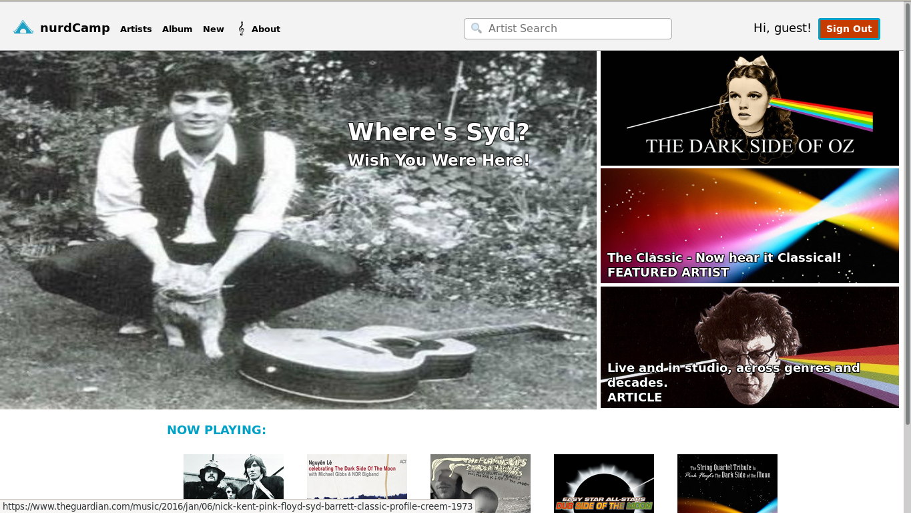

# nurdCamp

### nurdCamp is where we study. 
nurdCamp is a clone of [bandcamp](https://bandcamp.com/), the artists first music-sharing site. Users can browse artists and their albums, and of course play music.

## Technologies
* I utilize a Backend of Ruby on Rails, serving a jbuilder generated api.
    * Rails accesses a PostgreSQL database.
* My Frontend is dynamically generated through React
    * The Frontend store is managed through ReDux and its cycles.
* I sought to mimic the styling of the official site through painstaking CSS inspection and experimentation.
    * CSS All-Stars: `border-radius` & `:hover{transition:}` 

## Features

* Upon sucessful sign-in users are greeted with the home splash page. 
    * Signed-out or new users are greeted with a page prompting for their credentials, controlled through custom React Router routes checking credential cookies.
            
            const Protected = ({ component: Component, path, signedIn, exact }) => (
            <Route path={path} exact={exact} render={(props) => (
                signedIn ? (
                <Component {...props} />
                ) : (
                <Redirect to="/signin" />
                ))} />
            );
    * A similar function ensures signed-in users cannot access the sign-in or sign-up page.
    * This was a great exercise for me to learn how to sculpt CSS to match an image or existing site, with *pixel perfect* reproduction.
    * It was also a great learning experience in how to guide a user and inform them without overwhelming them.   
    * The bottom marquees a 'Now Playing' limited selection of the indexed artists.

* There is an Artists Index page displaying each artist, a thumbnail image with their name. A side tab displays extra information, and filter buttons at the top allow the user to narrow the selection.

* The user can also find an artist through the search bar embedded in the site's header.
    * First it filters the array of artists passed through React Props:
            
            artistSearch = this.props.artists.filter(artist => 
            artist.artist_name.toLowerCase().includes(this.state.search_term.toLowerCase()))
            
    * Then it maps the resulting array into elements naming and linking to each artist.

            artistList = artistSearch.map(artist => {
            const link = `/albums/1/artists/${artist.id}`
            const id = `artist-search-item-${artist.id}`
            const key = `artist-search-item-${artist.id}`
            return ( 
                
             
                        {artist.artist_name}
                
)
            })

* There is an artists show page displaying a larger image, information, and a track-listing.
    * These are dynamically generated by mapping over an array passed through React Props:
        
            songs = this.props.songs.map(song => {
            return(
                < li
                    key={song.id}
                    className="song-list-item" >
                         𝄞 {song.id}: {song.title}
                </li >) 
            })

* The final feature is an add artist page, where users can add new artists and their albums to the database.
    * I leveraged an older HTML input element, the datalist, to allower the user options in choosing the album art for their edition addition. 
    * They can either select from an image already present in the `public` folder on the Rails server, or link to art elsewhere.
            
            <input type="text"
                        className="artist-form"
                        list="albumArt"
                        value={this.state.artist_image}
                        onChange={this.update('artist_image')}
                        require d/>
                <datalist id="albumArt">
                    <option value="default.jpg"></option>
                    <option value="pinkfloyd.jpg"></option>
                    <option value="syd.jpg"></option>
                </datalist>
            </input>
    * Hosting thus allows the user the flexibility of sourcing the art by name or URL.
